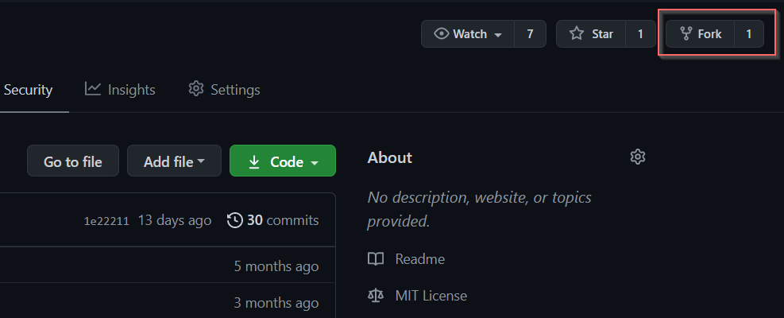
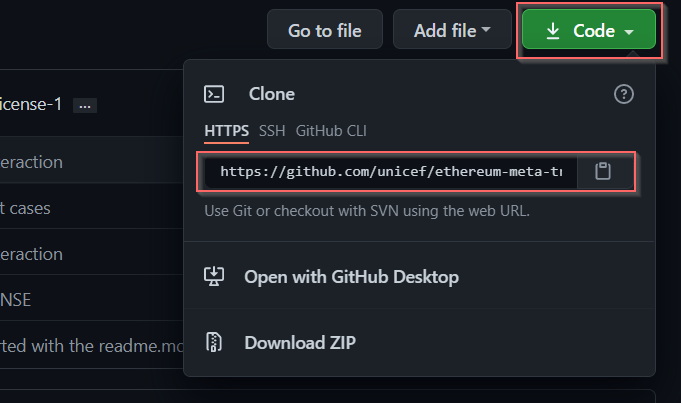

[](https://github.com/ellerbrock/open-source-badges/)
[](https://opensource.org/licenses/MIT)
[](https://www.codetriage.com/roshanjossey/first-contributions)

# MetaTx React Library

MetaTx Library is a React library that offers cost-free interactions with any specified smart contract, using an intermediate wallet.

* **Easy-to-use** for developers
* **Better user experience** for the end-user

## How to use

MetaTx library introduces two major components. We will explore the role of each one of them and how we can use them.

### MetaTx Component

To be able to use the library, we must first specify the intermediate wallet, the provider URL (ex: INFURA) and the smart contracts related to the application.
```js
<MetaTx privateKey={IntermadiateWalletPK} provider={Provider_URL} contracts={[contracts,...]}>
            *** here you specify the app component ***
</MetaTx>
```
A concrete example is as follows:
```js
<MetaTx 
    privateKey={"8da4ef21b864d2cc526dbdb2a120bd2874c36c9d0a1fb7f8c63d7f7a8b41de8f"} 
    provider={"https://rinkeby.infura.io/v3/<API_KEY>"} 
    contracts={[setAContract]}>
            *** here you specify the app component ***
</MetaTx>
```

With setAContract a constant, defined as follows:
``` js
export const setAContract = {
  address: <contract_deployment_address>,
  abi: SetAContract.abi
}
```

setAContract is a simple smart contract used as an example to show case the functioning of the MetaTx library.
You can find the SetA smart contract source code under the folder */contracts*.

### ExecuteMetaTx Component
Once we are done setting up the MetaTx component, we can go through the second step. The ExecuteMetaTx component is the one that handles the interaction with the specified smart contract. It is defined as follows:
```js
<ExecuteMetaTx contract={smart_contract} params={[method_inputs]} method={"method_name"} result={method_to_handle_result}/>
```

Let's suppose that we want our application to set a certain value for A, for example: "4". The ExecuteMetaTx Component will be defined as follows:
```js
<ExecuteMetaTx contract={setAContract} params={[4]} method={"setA"} result={setResult}/>
```
Where setResult is defined with the React State Hook, to save the transaction response. SetA is the smart contract's predefined method.

You can explore the whole example code in the following file: *src/App.tsx*.

## How to contribute

Interested to contribute to this project? These are the steps to follow.

### Fork this repository



Fork this repository by clicking on the fork button on the top of this page. This will create a copy of this repository in your account.

### Clone the repository



Now clone the forked repository to your machine. Go to your GitHub account, open the forked repository, click on the clone button and then click the *copy to clipboard* icon.

Open a terminal and run the following git command:

```
git clone <url you just copied>
```
where <url you just copied> is the url to this repository (your fork of this project).

And you are ready to code.
